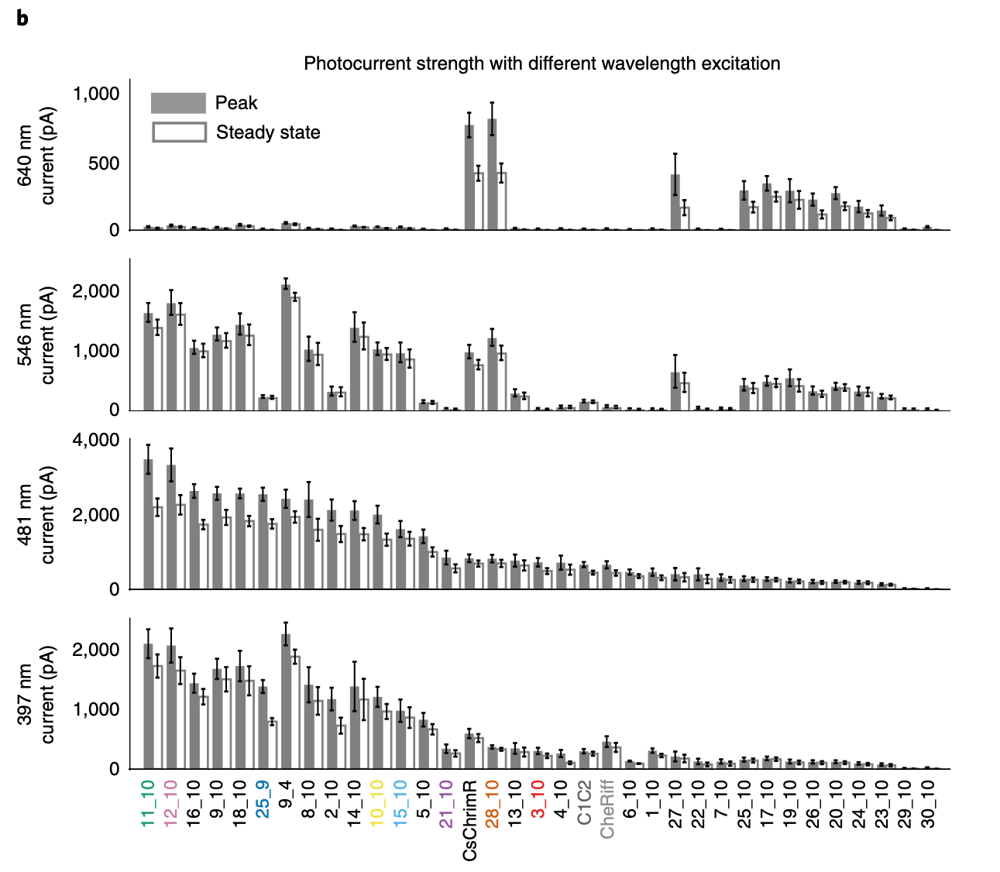
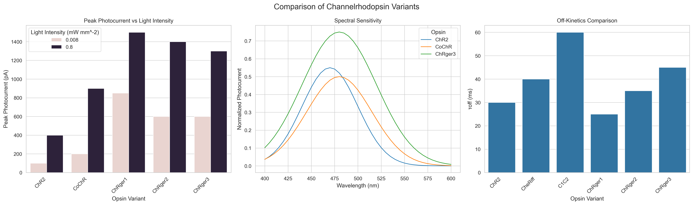

Use LLMs to generate and read plots. Combine them into a teacher-student pair to improve performance.

## Problem

Build a tool that can aggregate information from scientific figures into structured data. For example, extract the functional properities of different variants of opsins - both natual and engineered.

## Approach

Design an agent that takes in a data scenario and paper/figure examples and then outputs structured data, the data plotted into a figure, and several quantitative questions about the figure with difficulty rankings.

Use this agent to train another agent to extract quantitative information from figures using something like TextGrad or DSPy.

## Results

So far I have only implemented the generating agent. Here is an example of some input and output.

### Input

Prompt with both text and example figures.
```Python
generator = PlotGenerator(
        storage_dir = "~/dev/plotreader/storage", 
    )

generator.generate(
    data_scenario = (
        "Scientists are desigining new opsins by mutating existing ones. " +
        "They then measure the currents produced when exciting with different wavelengths of light. " + 
        "They plot comparisons of the different mutants and wild-type as function of these wavelengths."
    ),
    examples_dir='~/dev/plotreader/real_figures/opsins'
)
```

An example figure it was given.



### Output

#### Figure



#### Data

Light intensity response:
|FIELD1            |WT-ChR               |Opsin-A           |Opsin-B           |Opsin-C           |
|------------------|---------------------|------------------|------------------|------------------|
|0.01              |4.124397896267503e-05|0.0001059540004217|0.0035899412776994|0.0104908761574324|
|0.0162377673918872|8.794381440602552e-05|0.0002732796366424|0.0053279739865876|0.0151845704665584|
|0.0263665089873035|0.0001875111405745   |0.0007046955887369|0.0079000414600227|0.0219199534900151|
|0.0428133239871939|0.0003997605134787   |0.0018161401698191|0.0116975344461641|0.0315229340112086|
|0.069519279617756 |0.0008520564457072   |0.004673721674671 |0.0172850859518774|0.0450891218120366|
|0.1128837891684688|0.001815158535669    |0.0119825617016379|0.0254651257858557|0.0640073628649956|
|0.1832980710832435|0.0038626719966341   |0.0304301096532508|0.0373525000445081|0.0899177613721603|
|0.2976351441631317|0.0082008219901527   |0.075473992084935 |0.0544435608186378|0.1245419326524047|
|0.4832930238571752|0.0173263850205291   |0.1770975371647292|0.078641913473187 |0.169319501616085 |
|0.7847599703514611|0.0362355287031846   |0.3704746164195043|0.1121688566980884|0.2248374128842051|
|1.2742749857031337|0.0742224616918074   |0.6423975871196723|0.1572526203109489|0.2901832849468545|
|2.06913808111479  |0.1459996423395092   |0.8978752708018793|0.2155002092193508|0.3625496372515968|
|3.359818286283781 |0.2671584199593503   |1.0615310254653354|0.2869867526604381|0.4374767286064414|
|5.455594781168514 |0.4373686872841195   |1.1422400652583051|0.3693899501306819|0.5098413089242024|
|8.858667904100823 |0.6237255543060223   |1.1769288608980442|0.4577845492259719|0.5751840849603758|
|14.38449888287663 |0.77947875122856     |1.190949725043965 |0.545582281482288 |0.6306982504164962|
|23.357214690901213|0.8828676773729199   |1.1964753044949197|0.6263678984216486|0.6754720517033554|
|37.92690190732246 |0.9414263277435262   |1.1986311591754304|0.6956368747763603|0.7100928526528322|
|61.58482110660261 |0.9716495001539934   |1.1994689860510943|0.7515271625767528|0.7360004683203657|
|100.0             |0.9865015520260696   |1.1997940920353365|0.7944514922662287|0.754916536543001 |


Kinetic estimates:
|Opsin             |τ_on                 |τ_off             |
|------------------|---------------------|------------------|
|WT-ChR            |2.49816047538945     |16.24074561769746 |
|Opsin-A           |4.802857225639665    |16.239780813448107|
|Opsin-B           |3.927975767245621    |12.32334448672798 |
|Opsin-C           |3.3946339367881464   |44.647045830997406|

Spectral Senitivity:
|FIELD1            |WT-ChR               |Opsin-A           |Opsin-B           |Opsin-C           |
|------------------|---------------------|------------------|------------------|------------------|
|380               |0.1853352832366127   |0.0326249893418194|0.1418017549129514|0.0401181986881856|
|390               |0.2559242464341987   |0.0361032830772152|0.2270596690944281|0.040268370102322 |
|400               |0.3482340961814215   |0.0433307958458907|0.3444030097380389|0.0405854419351043|
|410               |0.4611122905071874   |0.0573530170603348|0.4884051089186319|0.0412270485434595|
|420               |0.5894075072376267   |0.0827243203480889|0.6433123917846779|0.0424709723265894|
|430               |0.7236384553447268   |0.1254714104618732|0.7844292349114812|0.0447808183160047|
|440               |0.8507374029168081   |0.1924023398839352|0.88400489715693  |0.0488871972305938|
|450               |0.9559551911095095   |0.2895182001958647|0.92              |0.0558728757954962|
|460               |1.025610980064846    |0.4195829608300196|0.88400489715693  |0.0672379637876794|
|470               |1.05                 |0.5794000341259371|0.7844292349114812|0.0849078102673069|
|480               |1.025610980064846    |0.7578367916551602|0.6433123917846779|0.111137293967509 |
|490               |0.9559551911095095   |0.9358075223868088|0.4884051089186319|0.1482682265892901|
|500               |0.8507374029168081   |1.0889962831015143|0.3444030097380389|0.1983189592668917|
|510               |0.7236384553447268   |1.193079881371613 |0.2270596690944281|0.2624298403625553|
|520               |0.5894075072376267   |1.23              |0.1418017549129514|0.3402488790811196|
|530               |0.4611122905071874   |1.193079881371613 |0.0860326862315446|0.4294018047679773|
|540               |0.3482340961814215   |1.0889962831015143|0.0529922377580402|0.5252245277701068|
|550               |0.2559242464341987   |0.9358075223868088|0.0351918957339109|0.6209192296589529|
|560               |0.1853352832366127   |0.7578367916551602|0.0264470280238272|0.7082161691290176|
|570               |0.1346579886225299   |0.5794000341259371|0.0225214742313636|0.7784930771093087|
|580               |0.1004055333627536   |0.4195829608300196|0.0209088598107014|0.8241589386454042|
|590               |0.0785655007845503   |0.2895182001958647|0.0203019163651122|0.8400000000000001|
|600               |0.0654084455711887   |0.1924023398839352|0.0200924323081576|0.8241589386454042|
|610               |0.0579109597339302   |0.1254714104618732|0.0200260800446858|0.7784930771093087|
|620               |0.0538659201394728   |0.0827243203480889|0.0200067817262247|0.7082161691290176|
|630               |0.0517981666618475   |0.0573530170603348|0.0200016252477186|0.6209192296589529|
|640               |0.0507960866914957   |0.0433307958458907|0.020000358960173 |0.5252245277701068|
|650               |0.0503354626279025   |0.0361032830772152|0.0200000730668451|0.4294018047679773|

And finally, the questions:
|difficulty        |question             |answer            |
|------------------|---------------------|------------------|
|Easy              |Which opsin has its peak spectral sensitivity at the longest wavelength?|Opsin-C has its peak spectral sensitivity at the longest wavelength, around 590 nm.|
|Medium            |Approximately how many times longer is the deactivation time constant (τ_off) compared to the activation time constant (τ_on) for WT-ChR?|The deactivation time constant (τ_off) for WT-ChR is approximately 10 times longer than its activation time constant (τ_on).|
|Hard              |At what approximate light intensity (in mW/mm²) does Opsin-A reach half of its maximum photocurrent response?|Opsin-A reaches approximately half of its maximum photocurrent response at a light intensity of about 1-2 mW/mm².|
